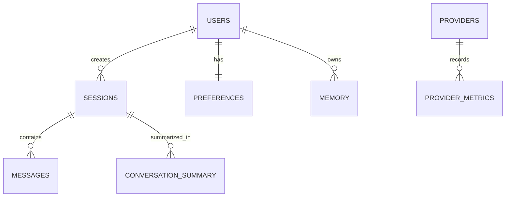

# Database Schema

## Entity Relationship Diagram

## Tables & Relationships

### `users`
Core user identity and subscription data.
* **id**: UUID (Primary Key)
* **email**: VARCHAR (Unique, Indexed)
* **password_hash**: VARCHAR
* **tier**: VARCHAR (e.g., 'free', 'pro', 'enterprise') - controls rate limits.
* **created_at**: TIMESTAMP
* **updated_at**: TIMESTAMP

### `sessions`
Groups messages into specific chat threads.
* **id**: UUID (Primary Key)
* **user_id**: UUID (Foreign Key -> users.id, Indexed)
* **title**: VARCHAR (Auto-generated by LLM)
* **created_at**: TIMESTAMP
* **updated_at**: TIMESTAMP

### `messages`
Stores individual conversation turns.
* **id**: UUID (Primary Key)
* **session_id**: UUID (Foreign Key -> sessions.id, Indexed)
* **role**: VARCHAR ('user', 'assistant', 'system', 'tool')
* **content**: TEXT
* **meta**: JSONB (Stores token usage, specific provider used, latency, citations)
* **created_at**: TIMESTAMP (Indexed for chronological sorting)

### `conversation_summary`
Stores rolling summaries of long sessions to prevent context window exhaustion.
* **id**: UUID (Primary Key)
* **session_id**: UUID (Foreign Key -> sessions.id, Unique)
* **summary**: TEXT
* **last_message_id**: UUID (Foreign Key -> messages.id) - Pointer tracking up to which message the summary encompasses.
* **created_at**: TIMESTAMP
* **updated_at**: TIMESTAMP

### `memory`
Long-term semantic memory leveraging pgvector for similarity search.
* **id**: UUID (Primary Key)
* **user_id**: UUID (Foreign Key -> users.id, Indexed)
* **entity**: VARCHAR (e.g., 'Fact', 'Preference', 'Relationship')
* **content**: TEXT
* **embedding**: VECTOR(1536) (pgvector type for semantic search)
* **created_at**: TIMESTAMP

### `preferences`
User-specific application configurations.
* **user_id**: UUID (Primary Key, Foreign Key -> users.id)
* **default_model**: VARCHAR (e.g., 'gpt-4-turbo')
* **system_prompt**: TEXT (Custom instructions)
* **theme**: VARCHAR
* **updated_at**: TIMESTAMP

### `provider_metrics`
Telemetry data for observability and failover decision making.
* **id**: UUID (Primary Key)
* **provider**: VARCHAR (Indexed)
* **endpoint**: VARCHAR
* **latency_ms**: INTEGER
* **status_code**: INTEGER
* **is_error**: BOOLEAN
* **created_at**: TIMESTAMP (Indexed for time-series aggregation)

### `search_cache`
Caches external web search results to reduce API costs and latency.
* **query_hash**: VARCHAR (Primary Key, SHA-256 of normalized query)
* **results**: JSONB (Serialized search results)
* **expires_at**: TIMESTAMP (Used for TTL cleanup)
* **created_at**: TIMESTAMP
