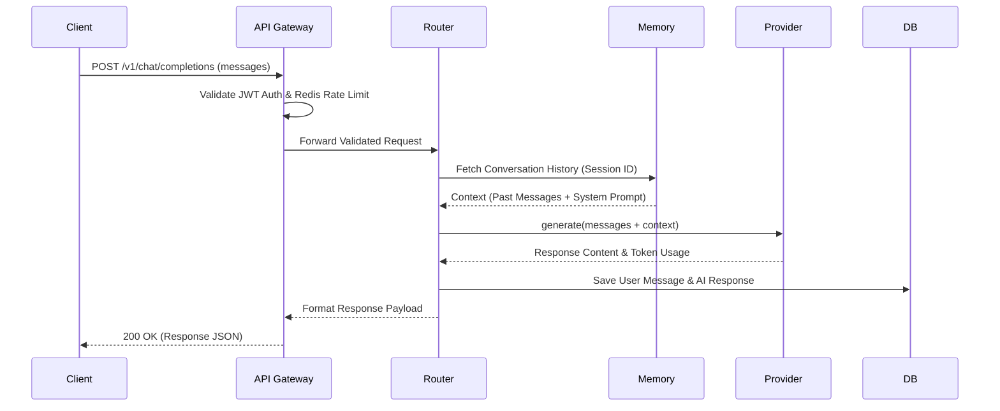
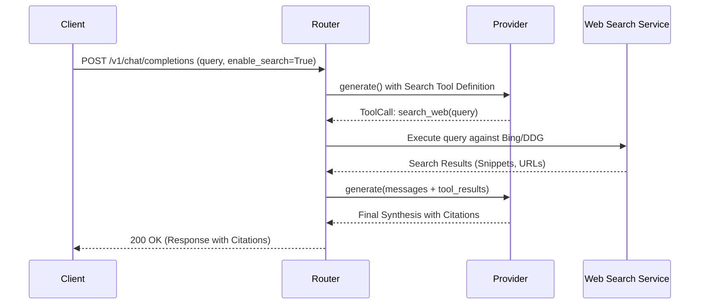
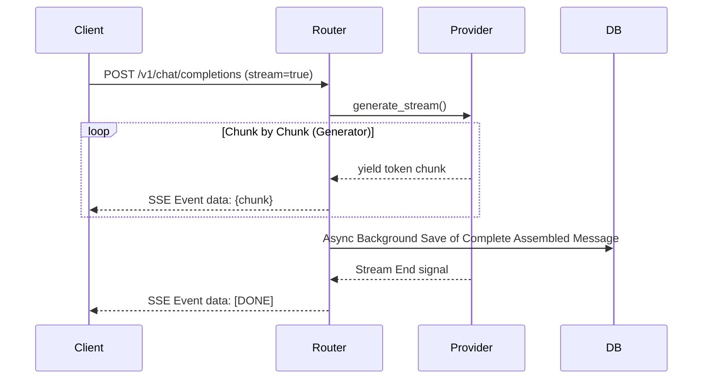
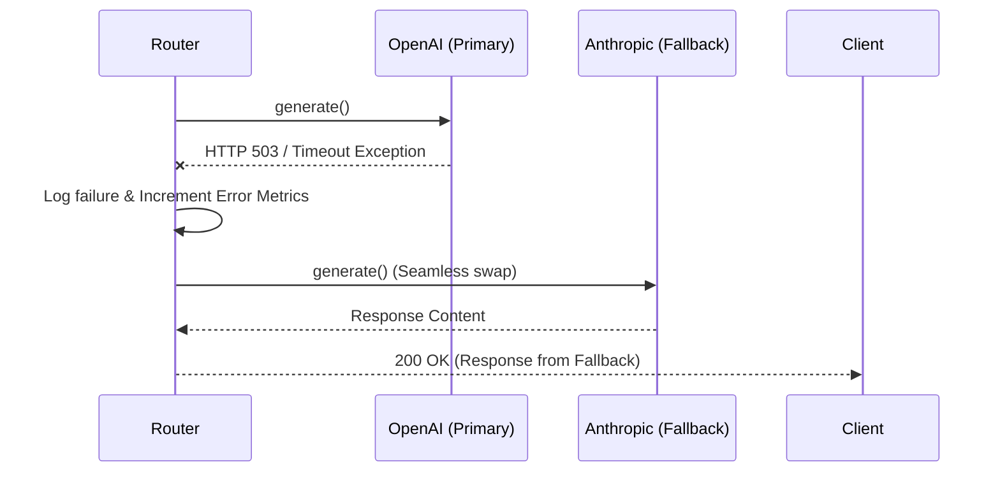
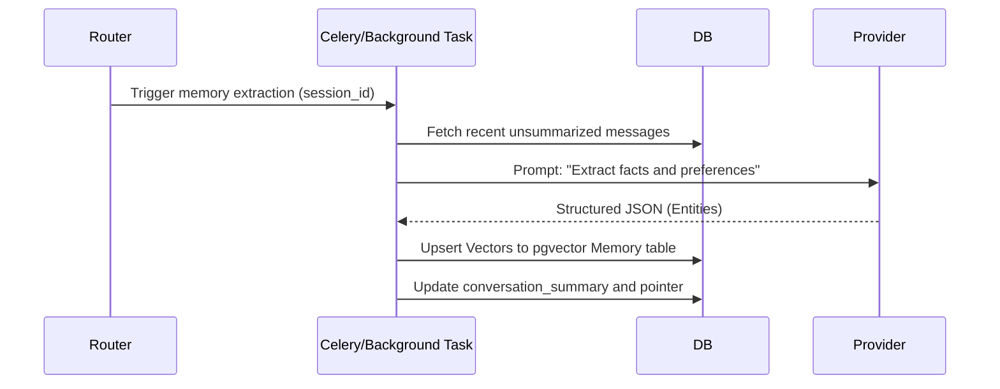

# Request Flows

## 1. Normal Conversation
Standard flow for stateless chat generation with context loading.

## 2. Search Conversation
Flow illustrating Agentic tool usage where the LLM decides to browse the web.

## 3. Streaming Conversation
Flow detailing low-latency token-by-token transmission to the client.

## 4. Provider Failover
Flow demonstrating system resilience when a primary AI API goes down.

## 5. Memory Update
Background process for updating long-term semantic memory and context summarization.

